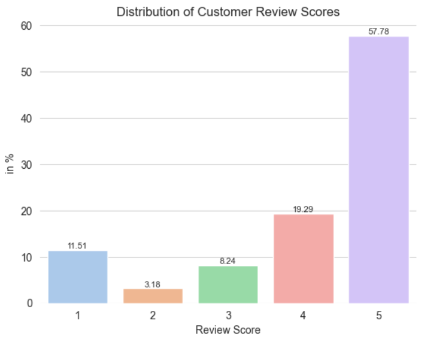
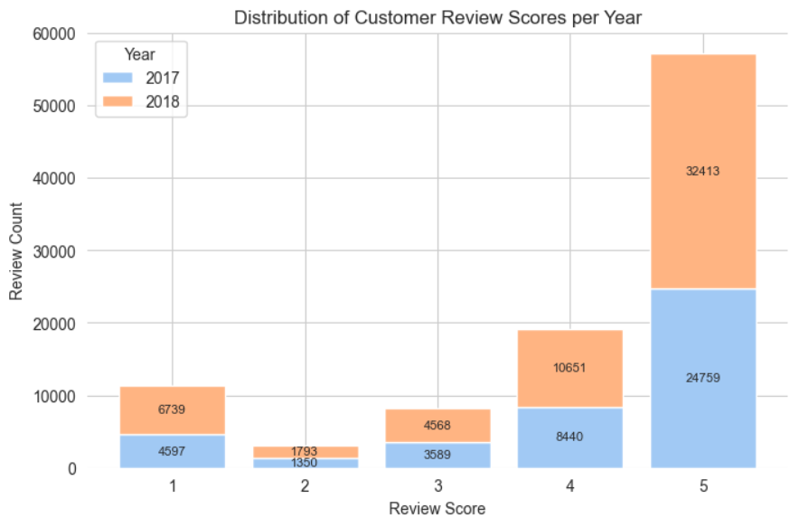
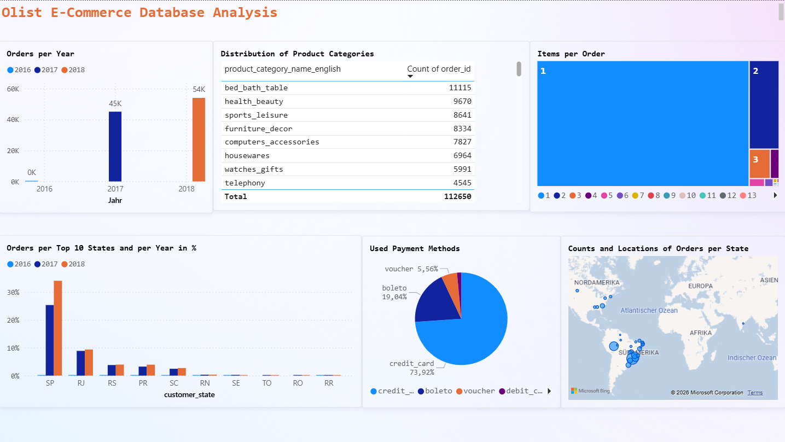

# olist-ecommerce-analysis

End-to-end data analysis project based on the Brazilian E-Commerce Public Dataset by Olist.  
The project focuses on sales performance, customer behavior, and delivery efficiency using SQL, SQLite, Jupyter Notebook, and Power BI.

## Dataset

Dataset source: https://www.kaggle.com/datasets/olistbr/brazilian-ecommerce

Download with `kagglehub`:

```python
import kagglehub

path = kagglehub.dataset_download("olistbr/brazilian-ecommerce")
```
The SQLite database is generated locally from the downloaded CSV files using the provided Jupyter Notebook.

## Project Structure

├── notebooks           # Jupyter notebooks with SQL analysis   
├── dashboard/           # Power BI dashboard files 
├── .gitignore
└── README.md

## Project Workflow
- Imported all CSV files into a SQLite3 database
- Created SQL queries in Jupyter Notebook for exploratory analysis
- Connected the .db file to Power BI using an ODBC driver
- Cleaned and transformed the data in Power BI:
    - removed duplicates
    - adjusted column data types
    - converted e.g. timestamps to the correct data type or ZIP codes to strings for better handling
    - transformed geospatial data into latitude/longitude values for map visualizations
- Designed and optimized relational data models in Power BI to
    - redefine key table relationships
    - improve query performance and data consistency
    - enable accurate filtering and aggregations across tables
    - support interactive dashboard visualizations

## Analysis Overview
The explored business questions in the Jupyter Notebook:
1. Which tables are included in the Olist Database?
2. How large is the dataset in e.g. the orders table?
3. What time period does the data cover?
4. What are the top 20 product categories by revenue of the sample?
5. How many orders were placed per year and what percentage of them were delayed?
6. How did the customers review their orders in 2017 and 2018?
Key Visuals



## Dashboard Preview


## Key Insights
Power BI Dashboard - Order Analysis:
1. The dataset mainly contains orders from 2017 and 2018. The number of orders increased by approximately 20% in 2018 compared to 2017.
2. Brazil represents the largest customer base. South Carolina (U.S.) is the fifth-largest customer state by number of orders.
3. The majority of customers purchase only one item per order.
4. The leading product categories are Bed Bath Table, Health Beauty, and Sports Leisure. Expanding the seller base in these categories could further drive platform growth and increase overall sales.

## Tools Used
- SQLite3
- SQL
- Jupyter Notebook
- Power BI Desktop
- Python (including libraries e.g.: Pandas, Matplotlib, Seaborn, Kagglehub)